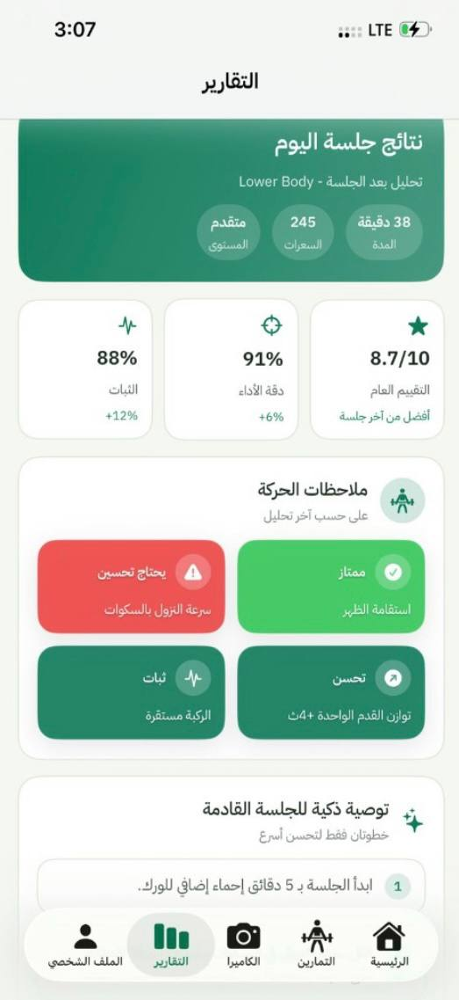
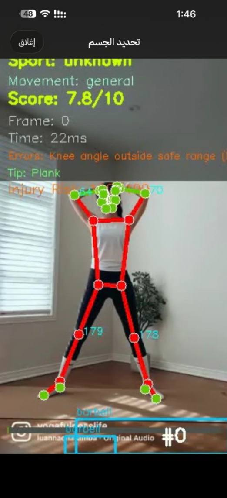

# Optimum

Optimum is an AI-powered mobile application that delivers a professional sports training experience through real-time movement analysis, performance scoring, and intelligent feedback.

It combines a Swift-based mobile application with an advanced AI system to provide accurate, data-driven coaching without the need for a personal trainer.

---

## Screenshots

  
  
  

  
  

---

## Problem

Many individuals struggle with training effectively due to:

- Lack of proper guidance during exercises  
- High cost of personal trainers  
- Risk of injury caused by incorrect form  
- No accurate way to measure performance and progress  

---

## Solution

Optimum transforms any mobile device into an intelligent personal coach by using artificial intelligence and computer vision to analyze human movements, evaluate performance, and provide real-time feedback.

---

## Core Capabilities

- Real-time motion and posture analysis  
- Per-movement performance scoring (0–10)  
- Instant feedback and error detection  
- Identification of strengths and weaknesses  
- Continuous progress tracking  

---

## AI Sports Movement Analysis

Optimum is powered by an advanced AI system designed to evaluate athletic performance using computer vision and biomechanical analysis.

### Key AI Features

- Pose estimation using MediaPipe
- Object detection and tracking using YOLO  
- Automatic sport recognition based on movement patterns  
- Biomechanics-based evaluation independent of user level  

---

### Performance Evaluation

- Movement scoring from 0 to 10  
- Detection of posture and alignment errors  
- Identification of strengths and mastered skills  
- Personalized improvement recommendations  

---

### Real-Time Processing

- Live skeletal tracking visualization  
- Object interaction tracking  
- Continuous performance updates  
- Support for live camera and uploaded videos  

---

### Reporting

- Detailed performance analysis reports  
- Export formats: PDF, CSV, JSON  
- Video output with overlays  
- Consistent analysis across real-time and offline processing  

---

## System Architecture

Optimum follows a modular and scalable architecture for real-time sports analysis:

- AI Analysis Layer: pose estimation, detection, evaluation  
- Video Processing Pipeline: live and uploaded video analysis  
- Biomechanical Engine: movement quality assessment  
- API Layer: communication between app and AI system  
- Reporting System: performance reports and exports  

---

## Technology Stack

- Swift (iOS App)  
- Python (AI Processing)  
- MediaPipe  
- YOLO  
- OpenCV  
- Machine Learning  

---

## Use Cases

- Home fitness training  
- Form correction for beginners  
- Athlete performance tracking  
- Injury prevention support  

---

## Vision

Optimum aims to make professional sports training accessible, scalable, and data-driven by transforming mobile devices into intelligent personal coaches.

---

## Project Context

Developed during SportHack2030, focusing on innovation in sports technology.
